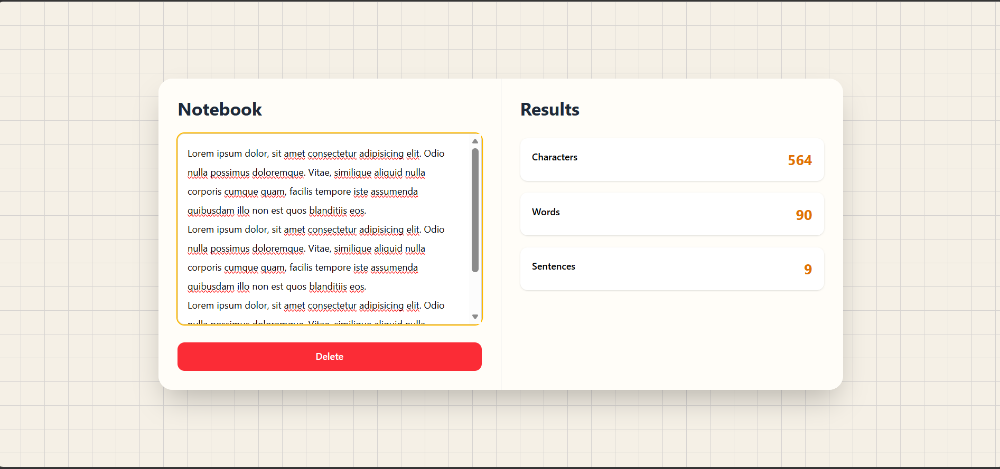

# Word Counter App

A simple and responsive Word Counter application built with React and Tailwind CSS. It allows users to type or paste text and instantly view the total number of characters, words, and sentences. The application features a clean notebook-inspired interface and adapts seamlessly to different screen sizes.

## Features

- Real-time character counting
- Real-time word counting
- Real-time sentence counting
- Delete button to clear all text and reset counts
- Responsive design for desktop, tablet, and mobile devices
- Notebook-inspired user interface
- Built with modern React using Hooks

## Technologies Used

- React
- JavaScript (ES6+)
- Tailwind CSS
- Vite

## Screenshot



## Getting Started

### Clone the repository

```bash
git clone https://github.com/Areej39/word-counter-app.git
```

### Navigate to the project directory

```bash
cd word-counter-app
```

### Install dependencies

```bash
npm install
```

### Start the development server

```bash
npm run dev
```

Open the local development URL shown in the terminal to view the application.

## Project Structure

```
word-counter-app/
├── public/
├── src/
│   ├── App.jsx
│   ├── main.jsx
│   ├── index.css
│   └── assets/
├── screenshot.png
├── package.json
├── vite.config.js
└── README.md
```

## Future Improvements

- Reading time estimation
- Paragraph counter
- Character count with and without spaces
- Dark mode
- Copy and download text functionality
- Text statistics visualization

## Author

GitHub: https://github.com/Areej39

### Live Demo

https://word-counter-app-areej39.netlify.app/